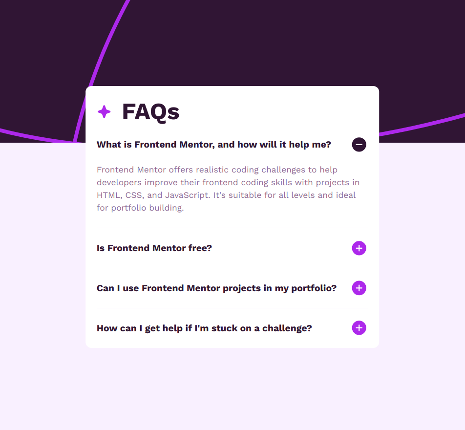

# Frontend Mentor - FAQ accordion solution

This is a solution to the [FAQ accordion challenge on Frontend Mentor](https://www.frontendmentor.io/challenges/faq-accordion-wyfFdeBwBz). Frontend Mentor challenges help you improve your coding skills by building realistic projects. 

## Table of contents

- [Overview](#overview)
  - [Screenshot](#screenshot)
  - [Links](#links)
- [My process](#my-process)
  - [Built with](#built-with)
- [Author](#author)

## Overview

### Screenshot

### Links

- Solution URL: [ Solution](https://www.frontendmentor.io/solutions/faq-accordion-0KEczeRQPj)
- Live Site URL: [ Live site](https://et-coder.github.io/faq-accordion/)

## My process

### Built with

- Semantic HTML5 markup
- CSS custom properties
- Mobile-first workflow
- Vanilla javascript

## Author

- Website - [Natnael Dejene](https://github.com/et-coder)
- Frontend Mentor - [@et-coder](https://www.frontendmentor.io/profile/et-coder)